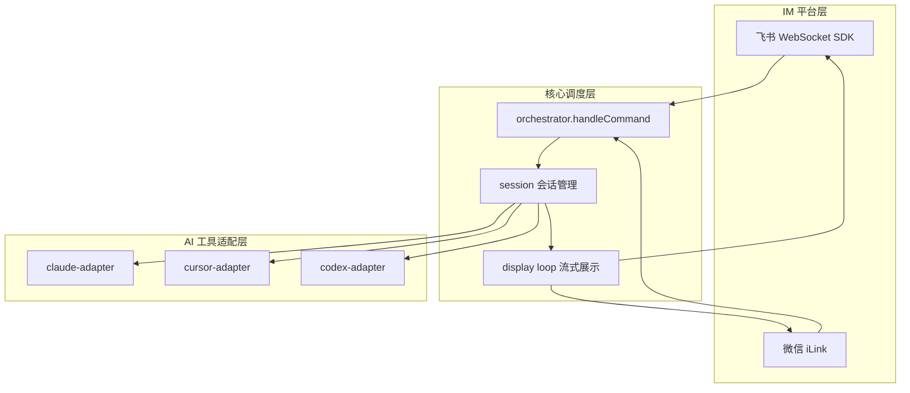

# ChatCCC 功能逻辑

ChatCCC 的核心功能逻辑可以概括为：**把 IM 消息桥接到本地 AI 编程工具，再把 Agent 的流式输出推回聊天窗口**。

---

## 一句话定位

你在飞书或微信发消息 → ChatCCC 识别会话与命令 → 调用 Claude Code / Cursor / Codex → 把思考过程、工具调用、最终回复推回聊天。

---

## 整体架构（三层）



| 层 | 职责 | 关键文件 |
|---|---|---|
| IM 平台 | 收消息、发文本/卡片、建群 | `index.ts`, `feishu-platform.ts`, `wechat-platform.ts` |
| 调度核心 | 命令分发、会话绑定、队列 | `orchestrator.ts`, `session-chat-binding.ts` |
| Agent 适配 | 统一接口对接各 CLI/SDK | `adapters/*-adapter.ts` |

---

## 启动流程

`src/index.ts` 的 `main()` 大致顺序：

1. **单实例检查** — 避免重复启动
2. **读配置** — `~/.chatccc/config.json`
3. **起 HTTP 服务** — Web 配置页 + Agent RPC（发图/发文件等）
4. **按配置启平台** — 飞书 SDK WebSocket、微信 iLink（可并行）
5. **重建会话映射** — 从 `session-registry` 恢复 chat ↔ session 绑定
6. **启动 display loop** — 定时把流式状态推到 IM 卡片/文本

---

## 消息处理主链路

```
收到消息
  → 去重（processedMessages）
  → 解析文本/图片/文件
  → handleCommand(platform, text, chatId, ...)
      → 是命令？走命令分支
      → 有会话上下文？走 prompt 或会话内命令
      → 无会话？提示发 /new
```

飞书入口在 `im.message.receive_v1` 事件；微信在 `handleWechatMessage`，最终都进同一个 `handleCommand`。

---

## 会话模型：一群一会话

### 创建会话 `/new [claude|cursor|codex]`

**飞书（群聊）**

1. 调用对应 adapter 创建 Agent session
2. 建新飞书群，把用户拉进去
3. 群描述写入 `前缀 + sessionId`（用于后续自动识别）
4. 绑定 `sessionId ↔ chatId`，写入 registry

**微信（私聊）**

- 不建群，在当前私聊里绑定 session
- 用 `session-registry.json` 记录 chatId → sessionId

### 自动恢复（Auto-resume）

在已有会话群里发普通消息（非 `/` 开头）：

1. 从群描述（或微信 registry）解析 `sessionId` + `tool`
2. 若该 session 正在生成 → **入队**或提示队列满
3. 否则调用 `resumeAndPrompt()` → `runAgentSession()`
4. Agent 流式输出写入 `stream-state`，由 display loop 推到 IM

---

## Agent 执行逻辑（`session.ts`）

`runAgentSession()` 是核心：

1. **并发控制** — 同一 session 同时只允许一个 prompt（`activePrompts`）
2. **选 adapter** — Claude SDK / Cursor CLI / Codex CLI
3. **注入 IM skills** — 让 Agent 能通过 HTTP 回传图片/文件到聊天
4. **流式消费** — 各 adapter 输出归一化为 `UnifiedBlock`（thinking、text、tool_use、tool_result…）
5. **持久化** — 写入 `stream-state`、session jsonl
6. **展示** — display loop 读状态，飞书用 CardKit 实时卡片，微信用纯文本增量推送
7. **结束** — 发最终回复、更新群名（首条消息自动命名）、处理队列下一条

---

## 命令体系（常用）

| 命令 | 作用 |
|---|---|
| `/new [tool]` | 新建会话（可选 claude/cursor/codex） |
| `/newh` | 重置当前会话（保留工作目录） |
| `/cd [path]` | 切换默认工作目录 |
| `/model` / `/model xxx` | 查看/切换模型 |
| `/stop` | 停止当前生成 |
| `/cancel` | 取消队列中的缓存消息 |
| `/sessions` | 查看所有会话状态 |
| `/git <cmd>` | 在当前会话 cwd 执行 git |
| `/restart` | 重启 ChatCCC 进程 |
| `/deleteg` | 解散飞书群（并清理绑定） |

有会话上下文时，`/` 开头走命令；否则走 prompt 发给 Agent。

---

## 飞书 vs 微信 差异

| 维度 | 飞书 | 微信 |
|---|---|---|
| 会话形态 | 一群一会话 | 私聊一对一 |
| 进度展示 | CardKit 流式卡片 | 纯文本增量 |
| session 识别 | 群描述 | registry 文件 |
| `/new` | 建新群 | 当前私聊绑定新 session |

---

## 关键设计点

1. **平台无关** — `PlatformAdapter` 抽象 IM；`ToolAdapter` 抽象 AI 工具，`orchestrator` 不直接依赖飞书 API
2. **display 与生成解耦** — Agent 在后台跑，display loop 独立轮询 `stream-state`，避免阻塞消息处理
3. **消息队列** — 同 session 忙时后续消息排队，避免并发 prompt
4. **SDK 重连安全** — WebSocket 重连只重建绑定，**不清** `activePrompts` / `processedMessages`，避免重复执行
5. **单实例 + 本地 HTTP** — 默认端口提供配置 UI 和 Agent 回调（发图/发文件等）

---

## 数据落盘位置

用户数据在 `~/.chatccc/`（Windows 常见为 `C:\Users\<用户名>\.chatccc\`）：

- `config.json` — 配置
- `session-registry.json` — chat ↔ session 绑定
- `logs/` — 运行日志、启动诊断
- stream-state / session 元数据 — 支撑恢复与流式展示

---

## 相关文档

- [架构.md](./架构.md) — 更完整的分层、模块索引与设计决策
- [README.md](../README.md) — 用户向部署与使用说明
