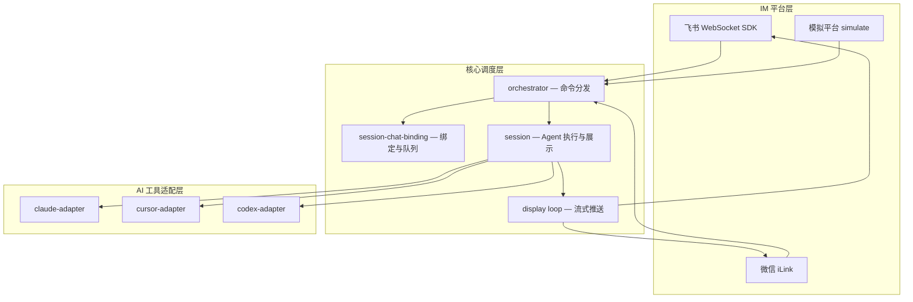

# ChatCCC 架构

ChatCCC 把本地 AI 编程工具（Claude Code、Cursor Agent、Codex CLI）接入即时通讯软件（飞书、微信 iLink），让你在手机上发消息即可远程驱动 Agent 写代码、查问题、跑命令。

本文描述系统分层、核心数据流、会话模型与关键设计决策，供维护与二次开发参考。

---

## 1. 总体分层

系统分为三层，通过接口解耦：



| 层 | 职责 | 关键模块 |
| --- | --- | --- |
| IM 平台 | 收发消息、建群、卡片/文本展示 | `index.ts`、`feishu-platform.ts`、`wechat-platform.ts`、`cardkit.ts` |
| 调度核心 | 命令路由、会话绑定、并发与队列 | `orchestrator.ts`、`session-chat-binding.ts`、`session.ts` |
| Agent 适配 | 对接各 CLI/SDK，输出归一化消息流 | `adapters/*-adapter.ts`、`adapters/adapter-interface.ts` |

### 1.1 两大适配器接口

**`PlatformAdapter`**（`platform-adapter.ts`）抽象 IM 平台能力：发文本/卡片、建群、更新群信息、CardKit 进度展示等。`orchestrator` 只依赖此接口，不直接调用飞书 API。

**`ToolAdapter`**（`adapters/adapter-interface.ts`）抽象 AI 工具：`createSession`、`prompt`（返回 `AsyncIterable<UnifiedStreamMessage>`）、`getSessionInfo`、`closeSession`。各 adapter 把底层差异统一为 `UnifiedBlock`（thinking、text、tool_use、tool_result 等）。

---

## 2. 进程与启动

入口为 `src/index.ts` 的 `main()`。

### 2.1 启动顺序

1. **崩溃日志** — `installCrashLogging`，未捕获异常写入 `~/.chatccc/logs/startup-trace.log`
2. **单实例** — `ensureSingleInstance`，按 PID 文件清理旧进程
3. **配置加载** — 读取 `~/.chatccc/config.json`（首次可从 `config.sample.json` 复制）
4. **HTTP 服务** — `web-ui.ts` 提供配置向导、Dashboard、Agent RPC（发图/发文件等）
5. **平台启动** — `buildPlatformStartupPlan` 按配置并行启动飞书、微信
6. **状态重建** — 从 `session-registry.json` 恢复 chat ↔ session 映射；`fixStaleStreamStates` 修正残留流状态
7. **display loop** — `startUnifiedDisplayLoop` 启动全局定时推送

### 2.2 运行模式

| 模式 | 触发 | 说明 |
| --- | --- | --- |
| 正常 SDK | 默认 | 飞书 WebSocket 长连接收事件 |
| 本地中继 | `--local` | 连接已有实例的 relay WebSocket，不独立建连 |
| 模拟 | `USE_SIMULATE` | 无飞书凭证，HTTP 注入消息，用于测试 |
| 配置向导 | 无有效凭证 | `startSetupMode`，浏览器完成首次配置 |

飞书与微信可同时启用：`startConfiguredPlatforms` 中飞书失败不阻断微信（`failOnFeishuError` 可配置）。

---

## 3. 消息处理主链路

所有 IM 入口最终汇聚到 `orchestrator.handleCommand()`。

```
收到消息
  → 去重（processedMessages，按 message_id）
  → 解析内容（文本 / 图片 / 文件 / 视频）
  → 可选：延迟送达提示、消息 reaction
  → handleCommand(platform, text, chatId, openId, msgTimestamp, chatType)
      → 全局命令（/restart、/updateg、/cd、/new …）
      → 有会话上下文 → 会话内命令或 prompt
      → 无会话 → 引导发 /new
```

### 3.1 飞书入口

- 事件 `im.message.receive_v1` → 解析 `open_id`、`chat_id`、`chat_type`
- 卡片按钮 `card.action.trigger` → 解析为等价文本命令再进 `handleCommand`

### 3.2 微信入口

- `wechat-platform.ts` 的 `handleWechatMessage` 下载媒体附件，拼入消息文本
- 所有会话视为 `p2p`；`/new` 在当前私聊绑定新 session，不建群
- 消息处理 **不 await** 长 prompt，避免阻塞 `/stop`、`/cancel` 等命令

---

## 4. 会话模型

核心约定：**一个 Agent session 对应一个 IM 会话容器**（飞书为群，微信为私聊）。

### 4.1 创建会话 `/new [claude|cursor|codex]`

`orchestrator` 中 `/new` 分支（`orchestrator.ts`）：

1. **创建 Agent session** — `initClaudeSession(tool)` → 对应 `ToolAdapter.createSession(cwd)`
2. **绑定 IM 容器**
   - **飞书**：`createGroup` → `updateChatInfo` 写入群描述 `{前缀} {sessionId}` → `bindChatToSession`
   - **微信私聊**：直接 `bindChatToSession`，记录到 `session-registry.json`
3. **持久化** — `recordSessionRegistry`、`saveSessionTool`、设置默认工作目录

群描述中的工具前缀（如 `Claude Session:`）用于后续从 `getChatInfo` 自动解析 `sessionId` 与 `tool`。

### 4.2 会话识别（Auto-resume）

| 场景 | session 来源 |
| --- | --- |
| 飞书群聊 | 群 `description` → `extractSessionInfo` |
| 微信私聊 | `session-registry.json` 中 `chatId` 记录 |
| 飞书私聊 | 不作为持久会话入口；非微信 p2p 绑定会被清理 |

识别到 session 后，非 `/` 开头消息走 **prompt**；`/stop`、`/model`、`/git` 等走 **会话内命令**。

### 4.3 群名自动命名

首条非命令消息到达时，若群名仍为「新会话」，取消息前 10 字 + 工作目录文件夹名，更新群名与 registry。

### 4.4 绑定数据结构

`session-chat-binding.ts` 维护：

- `sessionChatsMap`：sessionId → Set\<chatId\>
- `activePrompts`：sessionId → 活跃 prompt 控制（AbortController、进程 PID 等）
- `lastActiveChatMap`：sessionId → 用户最后发消息的 chatId（display 推送目标）
- `messageQueue`：session 忙时后续消息排队

`session-registry.json`（`~/.chatccc/state/`）是重启后重建绑定的权威来源。

---

## 5. Agent 执行

`resumeAndPrompt` → `runAgentSession`（`session.ts`）是单次 prompt 的核心。

### 5.1 执行步骤

1. **并发门禁** — `activePrompts` 标记 session 忙碌；重复 prompt 拒绝或在上层入队
2. **准备** — 获取 adapter、`getSessionInfo`、构建 IM skills 提示（`im-skills/`）
3. **调用** — `adapter.prompt(sessionId, userText, cwd, signal)` 消费异步流
4. **归一化累积** — 各 `UnifiedBlock` 写入内存累加器，并持久化到 `stream-state.json`
5. **进程监控** — 注册 CLI PID；资源监控检测 3 分钟 CPU/内存无变化则强制停止
6. **结束** — 更新 turn 计数、处理队列下一条、清理 `activePrompts`

### 5.2 IM Skills

Agent 可通过本地 HTTP 回调与 IM 交互，例如：

- `POST /api/agent/send-image` — 向聊天发图片
- `POST /api/agent/send-file` — 向聊天发文件

skills 目录在包内 `im-skills/`，运行时变量（cwd、session_id、回调 URL）注入到 prompt。

### 5.3 支持的 Agent

| 工具 | Adapter | 底层 |
| --- | --- | --- |
| claude | `claude-adapter.ts` | `@anthropic-ai/claude-agent-sdk` |
| cursor | `cursor-adapter.ts` | Cursor Agent CLI |
| codex | `codex-adapter.ts` | Codex CLI |

各 adapter 有独立的 session 元数据 store（`adapters/*-session-meta-store.ts`），落在 `~/.chatccc/state/`。

---

## 6. 流式展示（Display Loop）

Agent 生成与 IM 展示 **解耦**：后台写 `stream-state`，前台定时读取并推送。

`startUnifiedDisplayLoop`（`session.ts`）每轮遍历 `displayCards`：

1. 读取 `~/.chatccc/state/streams/{sessionId}.json`
2. 校验 chat 仍绑定该 session 且为 `lastActiveChat`
3. **飞书** — CardKit 创建/更新进度卡片（思考、工具调用、文本增量）
4. **微信** — 纯文本增量推送；结束时发送「━━━ 回答结束 ━━━」
5. 终态（`done` / `stopped` / `error`）后发送最终回复并清理 display 条目

卡片约每 9 分钟轮换（`CARD_ROTATE_MS`），避免飞书卡片过期。

### 6.1 StreamState 字段

| 字段 | 含义 |
| --- | --- |
| `status` | running / done / stopped / error |
| `accumulatedContent` | 展示用累积内容（含工具简化摘要） |
| `finalReply` | 本轮 LLM 文本累加（历史命名，非仅「最终一段」） |
| `turnCount` | 对话轮次 |
| `stuckAt` | 僵死检测标记，resume 时会新建 session |

---

## 7. 命令体系

`handleCommand` 按优先级分支处理。

### 7.1 全局命令（无需已有 session）

| 命令 | 作用 |
| --- | --- |
| `/new [tool]` | 新建会话；tool 默认取配置中的 defaultAgent |
| `/cd [path]` | 切换默认工作目录 |
| `/restart` | spawn 新进程后退出当前进程 |
| `/updateg` | 全局 npm 包更新并重启（仅全局安装时） |

### 7.2 会话内命令（需识别到 session）

| 命令 | 作用 |
| --- | --- |
| `/stop` | 中止当前生成 |
| `/cancel` | 取消队列中缓存的消息 |
| `/newh` | 重置当前会话（保留 cwd），切换绑定 |
| `/model` / `/model xxx` / `/model clear` | 查看/设置/清除模型覆盖 |
| `/sessions` | 列出所有会话状态 |
| `/state` | 当前会话详情 |
| `/git <子命令>` | 在会话 cwd 执行 git |
| `/deleteg` | 解散飞书群并清理绑定 |
| `/test` | 诊断用 |

### 7.3 普通消息（prompt）

非 `/` 开头 → `resumeAndPrompt`。若 session 正忙 → 入队或提示队列满（飞书发队列卡片，微信发文本提示）。

---

## 8. 飞书与微信差异

| 维度 | 飞书 | 微信 iLink |
| --- | --- | --- |
| 推荐场景 | 长期主力 | 快速试用 |
| 会话容器 | 群聊，一群一会话 | 私聊一对一 |
| session 识别 | 群描述 | session-registry |
| `/new` | 创建新群 | 当前私聊绑定新 session |
| 进度展示 | CardKit 流式卡片 | 纯文本增量 |
| 群管理 | 建群/重命名/解散/头像 | 不支持 |
| 接入成本 | 需配置飞书应用 | 扫码登录 |

---

## 9. 持久化与目录结构

用户数据根目录：`~/.chatccc/`（Windows：`C:\Users\<用户名>\.chatccc\`），与 npm 包安装位置分离，升级不丢数据。

```
~/.chatccc/
├── config.json              # 主配置（凭证、Agent、平台开关）
├── privacy.json             # 隐私脱敏规则
├── logs/
│   ├── index-*.log          # 主进程运行日志
│   └── startup-trace.log    # 启动/崩溃/重启诊断
└── state/
    ├── runtime.pid          # 单实例 PID
    ├── session-registry.json # chatId ↔ sessionId 绑定
    ├── sessions.json        # sessionId → tool 映射
    ├── recent_dirs.json     # /cd 历史目录
    ├── working_dir_{chatId}.txt
    ├── streams/{sessionId}.json  # 流式状态
    ├── turns/               # 每轮卡片记录
    ├── chat_logs/{chatId}.jsonl
    ├── ilink-auth.json      # 微信登录态
    └── avatar-image-keys.json
```

Agent 会话元数据、图片缓存等由各 adapter / `feishu-api` 在 `state/` 下分文件存储。

---

## 10. 关键设计决策

### 10.1 SDK 重连不清运行时状态

飞书 WebSocket `onReady` / `onReconnected` 只调用 `rebuildBindingsFromRegistry`，**不**调用 `resetState()`。避免：

- 后台 generator 变孤儿
- `processedMessages` 清空导致旧消息重放、prompt 双开

### 10.2 生成与展示解耦

长 prompt 在后台异步执行；display loop 独立轮询 `stream-state`。好处：

- 不阻塞 IM 消息线程（`/stop` 能及时响应）
- 多 chat 绑定同一 session 时，只向 `lastActiveChat` 推送

### 10.3 单 session 单 prompt + 消息队列

同一 `sessionId` 同时只允许一个活跃 `prompt`。并发消息进入队列，生成完成后由 `consumeQueuedMessage` 自动消费下一条。

### 10.4 显式成功判断

代码中避免 `if (result)` 把 `undefined` 成功当成失败，使用 `result !== false` 等显式比较（见 `AGENTS.md`）。

### 10.5 单实例与本地 HTTP

默认监听 `config.json` 中的 `port`（通常 18080），提供 Web UI 与 Agent RPC。`ensureSingleInstance` 防止端口与状态文件冲突。

---

## 11. 模块索引

| 文件 | 说明 |
| --- | --- |
| `src/index.ts` | 入口、飞书事件注册、平台启动编排 |
| `src/orchestrator.ts` | 命令分发与 `/new` 流程 |
| `src/session.ts` | Agent 执行、display loop、session 工具函数 |
| `src/session-chat-binding.ts` | chat ↔ session 映射、队列、activePrompts |
| `src/stream-state.ts` | 流式状态持久化 |
| `src/platform-adapter.ts` | IM 平台接口定义 |
| `src/feishu-platform.ts` | 飞书 API 封装 |
| `src/wechat-platform.ts` | 微信 iLink 接入 |
| `src/cardkit.ts` | 飞书 CardKit 卡片 |
| `src/cards.ts` | 各类业务卡片 JSON 构建 |
| `src/config.ts` | 配置加载与用户目录 |
| `src/web-ui.ts` | 配置向导与 Dashboard |
| `src/im-skills.ts` | IM 交互 skills 注入 |
| `src/git-command.ts` | `/git` 命令执行 |
| `src/trace.ts` | 请求链路 traceId 日志 |
| `src/adapters/*.ts` | 各 Agent 适配器 |

---

## 12. 相关文档

- [Claude LiteLLM 本地代理](./claude-litellm-proxy.md) — 调试 Anthropic 兼容端点
- 用户向说明见仓库根目录 [README.md](../README.md)
